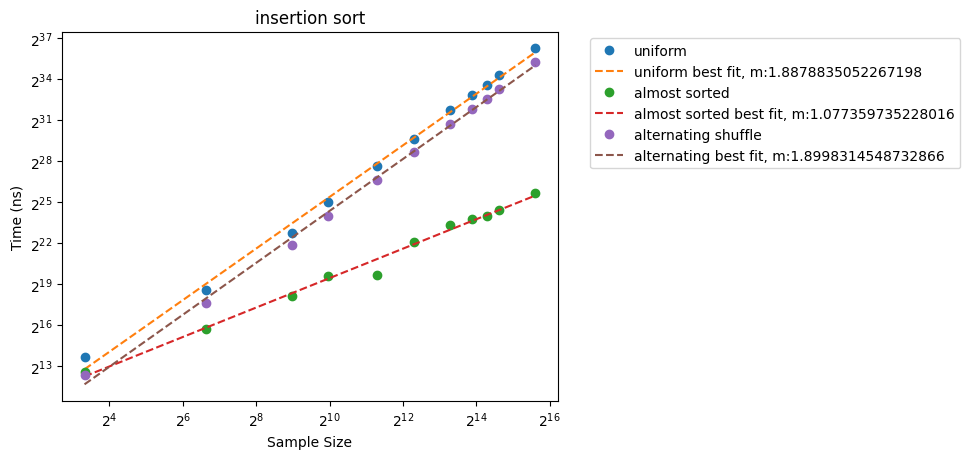
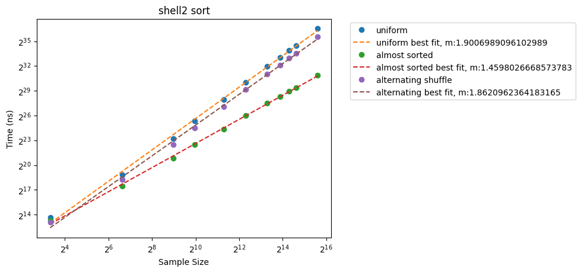
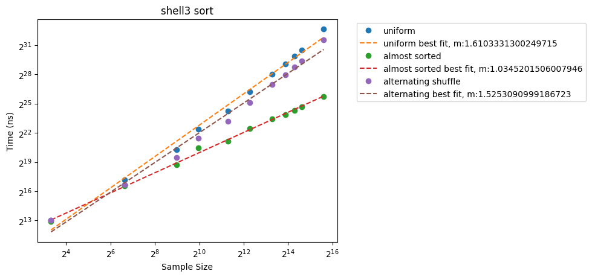
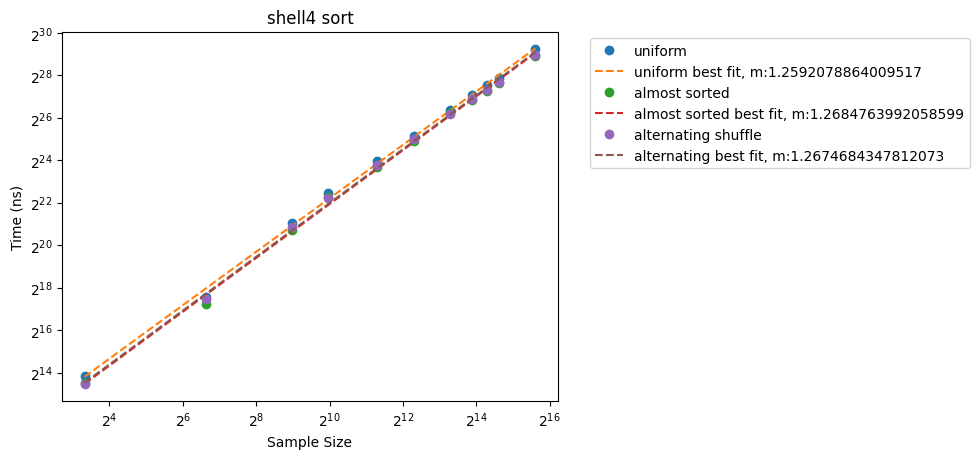
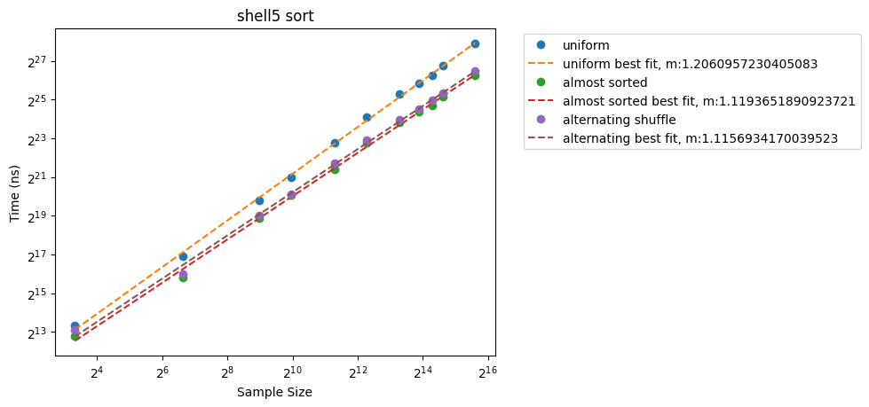
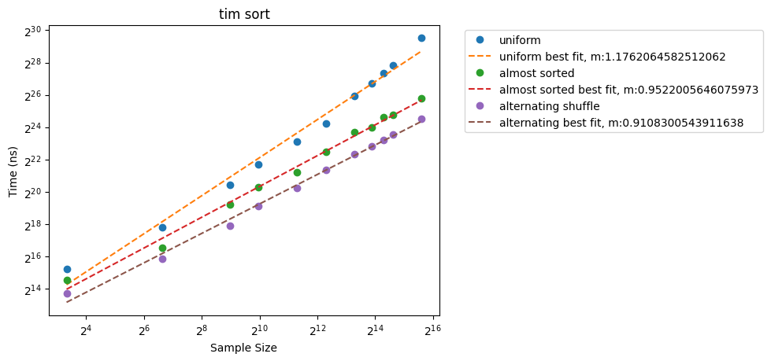

Awesome — based on all your provided plots and our outline, here’s a **draft of the Results & Analysis section** for your report:

---

# **4. Results and Analysis**

In this section, we present and analyze the empirical performance of the implemented sorting algorithms. Each algorithm was tested on three different types of input distributions: uniformly random permutations, almost-sorted permutations, and two alternating runs permutations. The results are plotted on log-log scales, and the slope of a best-fit line was determined to estimate the asymptotic behavior experimentally.

---

## **4.1 Insertion Sort**

Insertion sort exhibited very different behavior depending on the input distribution:

- **Uniform random input:** Slope ≈ **1.888**, indicating near-quadratic \( O(n^2) \) behavior, as expected for random data.
- **Almost sorted input:** Slope ≈ **1.077**, showing near-linear \( O(n) \) performance due to fewer necessary swaps.
- **Alternating runs input:** Slope ≈ **1.899**, again suggesting nearly quadratic behavior similar to the uniform case.

Insertion sort is highly sensitive to initial order: it performs very efficiently on nearly sorted inputs but poorly on disordered ones. These results are consistent with theoretical expectations.

---

## **4.2 Shellsort Variants**

### **Shell1 Sort (Original Shell sequence)**

- Slopes: **1.221** (uniform), **1.131** (almost sorted), **1.132** (alternating).
- All three distributions show similar, improved performance over insertion sort.
- Running time grows slightly faster than linear but significantly slower than quadratic.

Shell1 improves runtime across all distributions, moderately insensitive to input ordering.

---

### **Shell2 Sort (Sequence: 2[n/2^(k+1)] + 1)**

- Slopes: **1.901** (uniform), **1.460** (almost sorted), **1.862** (alternating).
- Performance worsened compared to Shell1, particularly on uniform and alternating data.

Shell2's sequence results in a higher time complexity closer to \( O(n^2) \) on random and structured inputs, making it less efficient than other Shellsort variants.

---

### **Shell3 Sort (A083318: 2k + 1 Sequence)**

- Slopes: **1.610** (uniform), **1.035** (almost sorted), **1.525** (alternating).
- Almost sorted inputs yield near-linear performance, but uniform and alternating are still closer to quadratic.

Shell3 is sensitive to the input distribution. It excels with near-sorted data but less so with random or structured alternating data.

---

### **Shell4 Sort (A003586: Powers of 2 and 3 Sequence)**

- Slopes: **1.259** (uniform), **1.269** (almost sorted), **1.267** (alternating).
- All input types yield very similar slopes (~1.26).

Shell4 is remarkably stable across input distributions. This makes it a reliable choice if input characteristics are unknown in advance.

---

### **Shell5 Sort (A003462: (3^k - 1) / 2 Sequence)**

- Slopes: **1.207** (uniform), **1.119** (almost sorted), **1.116** (alternating).
- Lower slopes across all distributions, close to linear behavior.

Shell5 is the most efficient Shellsort variant tested. It maintains low complexity regardless of input type, suggesting a highly optimized gap sequence.

---

## **4.3 Tim-sort**

- Slopes: **1.176** (uniform), **0.952** (almost sorted), **0.911** (alternating).
- Sublinear slope observed for almost sorted and alternating data.

Tim-sort adapts very efficiently to structured data, which aligns with its design to exploit runs in the input. It outperforms Shellsort variants and insertion sort particularly on almost-sorted and alternating runs inputs.

---

# **Summary of Experimental Slopes**

| Algorithm      | Uniform Slope | Almost Sorted Slope | Alternating Slope |
| :------------- | :------------ | :------------------ | :---------------- |
| Insertion Sort | 1.888         | 1.077               | 1.899             |
| Shell1 Sort    | 1.221         | 1.131               | 1.132             |
| Shell2 Sort    | 1.901         | 1.460               | 1.862             |
| Shell3 Sort    | 1.610         | 1.035               | 1.525             |
| Shell4 Sort    | 1.259         | 1.269               | 1.267             |
| Shell5 Sort    | 1.207         | 1.119               | 1.116             |
| Tim-sort       | 1.176         | 0.952               | 0.911             |
